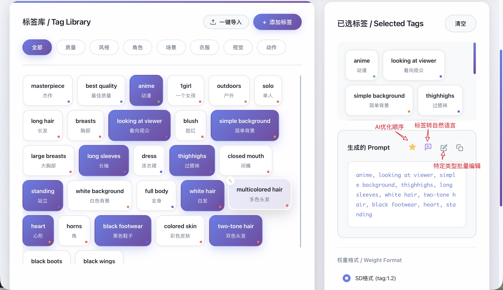
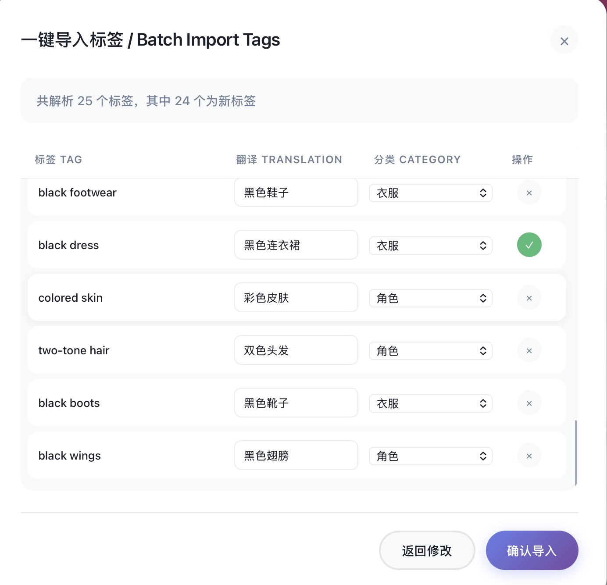
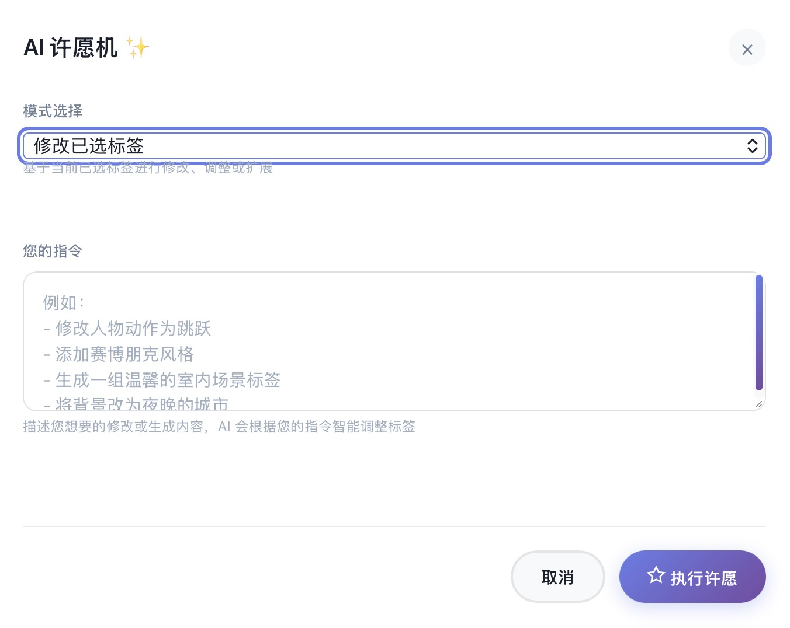
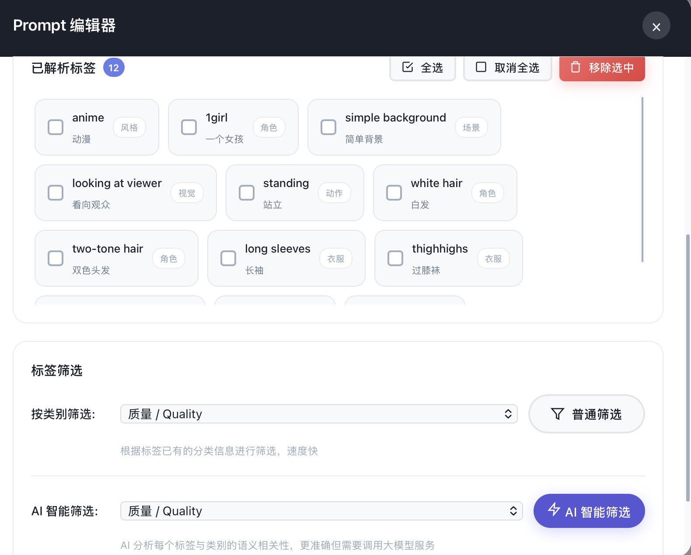
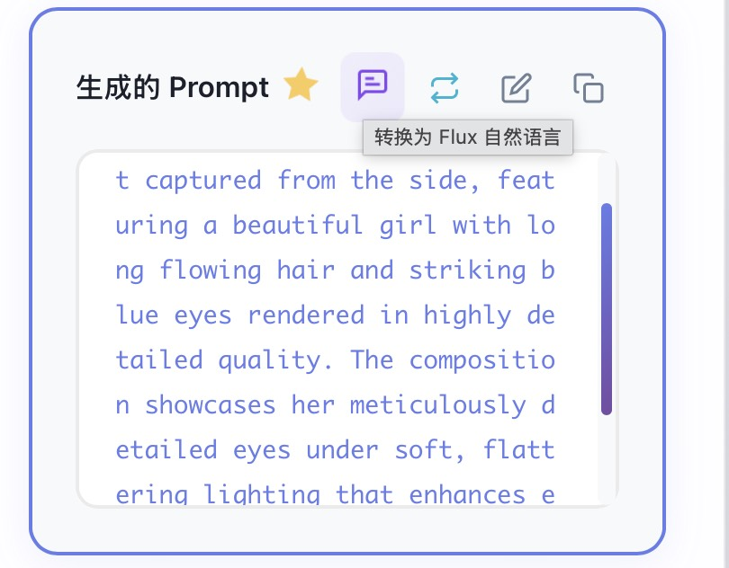
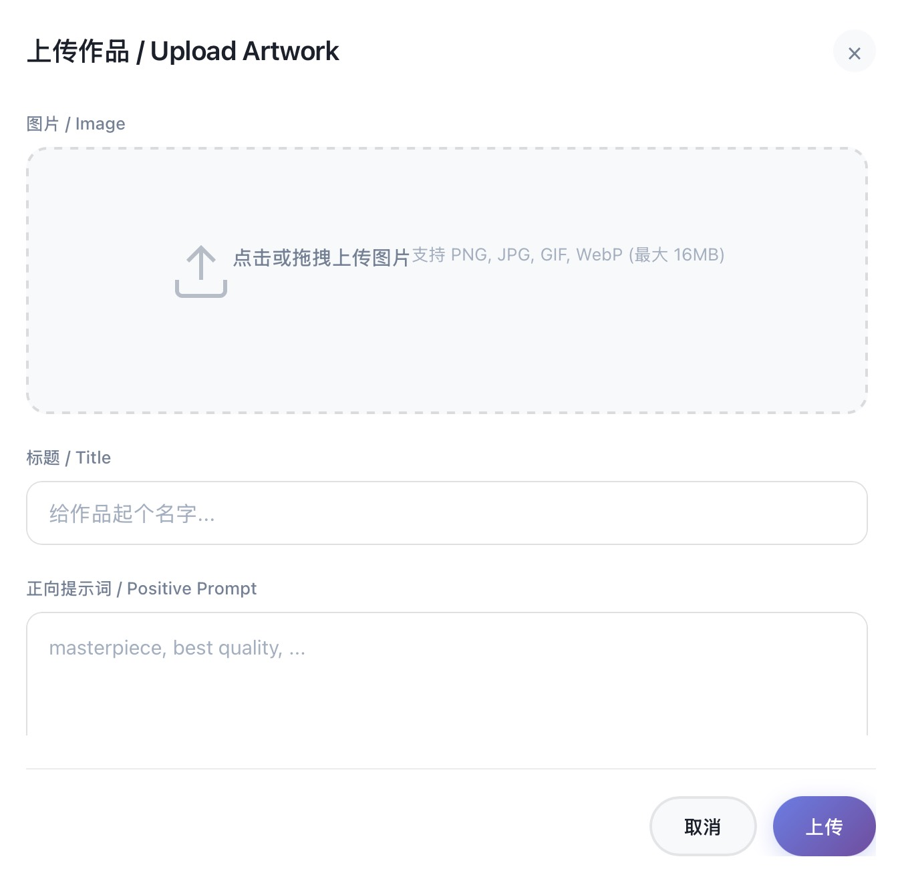

# AI Tag Manager 🎨

<div align="center">


**A powerful web-based tag management and prompt generation system for AI image generation**

[Features](#features) • [Demo](#demo) • [Installation](#installation) • [Usage](#usage) • [API](#api-reference) • [Contributing](#contributing)

[中文文档](README_CN.md)

</div>

---

## 📖 Overview

AI Tag Manager is a comprehensive web application designed specifically for AI image generation tools like Stable Diffusion, NovelAI, and Midjourney. Integrated with large language models, it can leverage AI to manage tags and generate the tags users need, such as using AI commands to change character actions.



### 🎯 Key Highlights

- **🏷️ Tag Library Management** - Organize tags by categories with custom colors
- **✨ AI-Powered Features** - Smart tag optimization, Flux prompt conversion, and AI Wishing Machine
- **📝 Multi-Format Support** - SD, NAI, and plain text prompt formats
- **🖼️ Gallery System** - Store and track your generated images with their prompts
- **🔌 Multi-LLM Support** - Integrated with OpenAI, Claude, Gemini, and local Ollama
- **📱 Responsive Design** - Perfect support for desktop and mobile devices

---

## ✨ Features

### 1️⃣ One-Click Batch Import

Import multiple tags and use AI to automatically categorize them based on your custom categories:



### 2️⃣ AI Wishing Machine

Adjust actions or edit styles based on selected tags. After entering a command, AI automatically selects appropriate tags from the library. Can also directly generate tags from library based on user requirements.



### 3️⃣ Batch Editing

Remove all action-related words, or have AI analyze which words are related to selected categories, then highlight relevant words for you to decide which tags to delete. This makes it extremely convenient to modify character actions, clothing, backgrounds, etc.



### 4️⃣ One-Click Optimization

Click the magic button to optimize prompt order with one click. When you've selected a bunch of prompts and the order is messy, let AI optimize the sequence to help the model better understand the prompts.

### 5️⃣ Tag to Natural Language Conversion

When using Flux-type models, you can still use tag combinations, then AI will convert tags into sentences.



### 6️⃣ Gallery Support

When you've created excellent works, you can upload them to the gallery along with their prompts for easy reproduction or iterative modification later.



Support for multiple AI services:
- **OpenAI (GPT)** - GPT-3.5, GPT-4, GPT-4-turbo
- **Anthropic (Claude)** - Claude 3 Haiku, Sonnet, Opus
- **Google (Gemini)** - Gemini Pro, Gemini 1.5 Pro
- **Ollama (Local)** - Run models locally without API keys

---

## 🚀 Quick Start

### Prerequisites
- Python 3.7 or higher
- pip package manager

### Installation

1. **Clone the repository**
```bash
git clone https://github.com/yourusername/AI2IMG_Tag.git
cd AI2IMG_Tag
```

2. **Install dependencies**
```bash
pip install flask
```

3. **Run the application**
```bash
python app.py
```

4. **Access the application**

Open your browser and navigate to: `http://localhost:5000`

### First Run

On first launch, the application automatically creates:
- `data/` directory with sample data
- `data/tags.json` with example tags and categories
- `data/gallery.json` for gallery items
- `data/config.json` for LLM configuration
- `static/uploads/` for image uploads

**No manual setup required!**

---

## 📚 Usage Guide

### Managing Tags

1. Click the **"Add Tag"** button
2. Fill in English and Chinese names
3. Select a category
4. Set the weight value (optional)
5. Click **Save**

### Generating Prompts

1. Click tags from the library to select them
2. Selected tags appear in the right panel
3. Choose your preferred format (SD/NAI/Plain)
4. Use AI features:
   - **✨ AI Optimize**: Reorder tags intelligently
   - **💬 Flux Convert**: Transform to natural language
   - **✏️ Edit**: Modify with the prompt editor
5. Click **Copy** to get your prompt

### Using AI Wishing Machine

1. Click the **"✨ AI Wishing Machine"** button in the header
2. Choose mode:
   - **Modify**: Adjust currently selected tags
   - **Generate**: Create new tags from library
3. Enter your natural language instruction
4. Click **Execute Wish**
5. AI processes your request and updates tags automatically

### Managing Gallery

1. Navigate to **Gallery** page
2. Drag & drop or click to upload images
3. Fill in the title and prompts used
4. Click **Upload** to save
5. View, edit, or delete items as needed

---

## 🔧 Configuration

### LLM Setup

1. Click the **⚙️ Settings** button
2. Enable **"LLM Service"** toggle
3. Select your provider:
   - OpenAI (GPT)
   - Anthropic (Claude)
   - Google (Gemini)
   - Ollama (Local)
4. Configure settings:
   - API Key (not needed for Ollama)
   - Base URL (auto-filled)
   - Model name
5. Click **Test Connection** to verify
6. Click **Save Settings**

### Using Ollama Locally

For completely offline LLM features:

1. Install Ollama from [https://ollama.ai](https://ollama.ai)
2. Download a model:
```bash
ollama pull llama2
# Or other models
ollama pull mistral
ollama pull qwen
```
3. Configure in the app:
   - Provider: **Ollama (Local)**
   - Base URL: `http://localhost:11434`
   - Model: `llama2` (or your downloaded model)
   - API Key: Leave empty

---

## 📡 API Reference

### Tags

| Method | Endpoint | Description |
|--------|----------|-------------|
| GET | `/api/tags` | Get all tags and categories |
| POST | `/api/tags` | Create a new tag |
| PUT | `/api/tags/<id>` | Update a tag |
| DELETE | `/api/tags/<id>` | Delete a tag |
| POST | `/api/tags/parse` | Parse and translate tags with AI |
| POST | `/api/tags/optimize-order` | AI-optimize tag order |
| POST | `/api/tags/convert-to-flux` | Convert to Flux natural language |
| POST | `/api/tags/wish` | AI Wishing Machine endpoint |

### Categories

| Method | Endpoint | Description |
|--------|----------|-------------|
| GET | `/api/categories` | Get all categories |
| POST | `/api/categories` | Create a new category |
| PUT | `/api/categories/<id>` | Update a category |
| DELETE | `/api/categories/<id>` | Delete a category |

### Gallery

| Method | Endpoint | Description |
|--------|----------|-------------|
| GET | `/api/gallery` | Get all gallery items |
| POST | `/api/gallery` | Upload a new artwork |
| PUT | `/api/gallery/<id>` | Update a gallery item |
| DELETE | `/api/gallery/<id>` | Delete a gallery item |

### Configuration

| Method | Endpoint | Description |
|--------|----------|-------------|
| GET | `/api/config` | Get current LLM configuration |
| PUT | `/api/config` | Update LLM configuration |
| POST | `/api/config/test-llm` | Test LLM connection |

---

## 🏗️ Project Structure

```
AI2IMG_Tag/
├── app.py                  # Flask backend application
├── data/
│   ├── tags.json          # Tags and categories database
│   ├── gallery.json       # Gallery database
│   └── config.json        # LLM configuration
├── static/
│   ├── script.js          # Main page JavaScript
│   ├── gallery.js         # Gallery page JavaScript
│   ├── style.css          # Stylesheet
│   └── uploads/           # User uploaded images
├── templates/
│   ├── index.html         # Main page (tag management)
│   └── gallery.html       # Gallery page
├── README.md              # English documentation
└── README_CN.md           # Chinese documentation
```

---

## 🛠️ Tech Stack

### Backend
- **Flask** - Python web framework
- **Python 3.7+** - Core programming language
- **JSON** - File-based data storage

### Frontend
- **HTML5** - Semantic markup
- **CSS3** - Modern styling with animations
- **Vanilla JavaScript** - No framework dependencies

---

## 📊 Data Structures

### Tag Data (tags.json)
```json
{
  "categories": [
    {
      "id": "cat_1234567890",
      "name_en": "Style",
      "name_zh": "风格",
      "color": "#6366f1"
    }
  ],
  "tags": [
    {
      "id": "tag_1234567890",
      "name_en": "anime",
      "name_zh": "动漫",
      "category_id": "cat_1234567890",
      "weight": 1.0,
      "created_at": "2024-01-01T00:00:00"
    }
  ]
}
```

### Gallery Data (gallery.json)
```json
{
  "items": [
    {
      "id": "item_1234567890",
      "image": "image_filename.png",
      "title": "Artwork Title",
      "positive_prompt": "positive prompt text",
      "negative_prompt": "negative prompt text",
      "created_at": "2024-01-01T00:00:00"
    }
  ]
}
```

---

## 🤝 Contributing

Contributions are welcome! Please feel free to submit a Pull Request. For major changes, please open an issue first to discuss what you would like to change.

### Development Setup

1. Fork the repository
2. Create your feature branch: `git checkout -b feature/AmazingFeature`
3. Commit your changes: `git commit -m 'Add some AmazingFeature'`
4. Push to the branch: `git push origin feature/AmazingFeature`
5. Open a Pull Request

---

## 📝 License

This project is licensed under the MIT License - see the [LICENSE](LICENSE) file for details.

---

<div align="center">

**Made with ❤️ for AI Artists**

⭐ Star us on GitHub if this project helped you!

</div>
